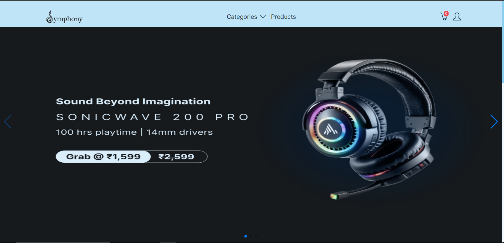

# Symphony

[Symphony](https://symphonyecom.netlify.app/) is a frontend for an ecommerce website specializing in headphones and earphones. It provides a seamless shopping experience with features such as product display, filtering, and category pages. Built with Tailwind CSS and React, Symphony is optimized for responsiveness across all devices.

## Table of Contents

-   [Features](#features)
-   [Technologies Used](#technologies-used)
-   [Getting Started](#getting-started)
-   [Contributing](#contributing)
-   [Contact](#contact)

## Features

-   **Product Display:** Browse a wide range of headphones and earphones with detailed descriptions and images.
-   **Filtering:** Easily filter products based on categories, price, and other attributes.
-   **Categories:** Explore products conveniently organized into categories for easy navigation.
-   **Responsive Design:** Enjoy a consistent user experience across desktops, tablets, and mobile devices.

## Technologies Used

-   **React:** Building the frontend user interface.
-   **Tailwind CSS:** Styling the components for a modern and responsive design.
-   **Sanity:** Storing product data for efficient retrieval and management.
-   **Firebase:** Handling user authentication to ensure a secure shopping experience.
-   **Netlify** Symphony is hosted on Netlify, ensuring high availability and fast loading times for a smooth user experience.

## Getting Started

To run Symphony locally, follow these steps:

1. Clone the repository: `git clone https://github.com/lokesh-bhortake/symphony.git`
2. Install dependencies: `npm install`
3. Start the development server: `npm run dev`
4. Open your browser and navigate to `http://localhost:5173` to view Symphony.

## Contributing

Contributions are welcome! If you have any suggestions, bug fixes, or new features to add, please open an issue or submit a pull request on GitHub.

1. Fork the repository and clone it to your local machine.
2. Create a new branch for your feature or bug fix.
3. Make your changes, commit them, and push to your fork.
4. Submit a pull request detailing your changes.

## Contact

For any questions, concerns, or collaboration inquiries, feel free to reach out to me:

-   Email: lb5102001@gmail.com
-   LinkedIn: [Lokesh Bhortake](https://www.linkedin.com/in/lokesh-bhortake/)

I appreciate your interest in Symphony! Your feedback and contributions are valuable to me.
